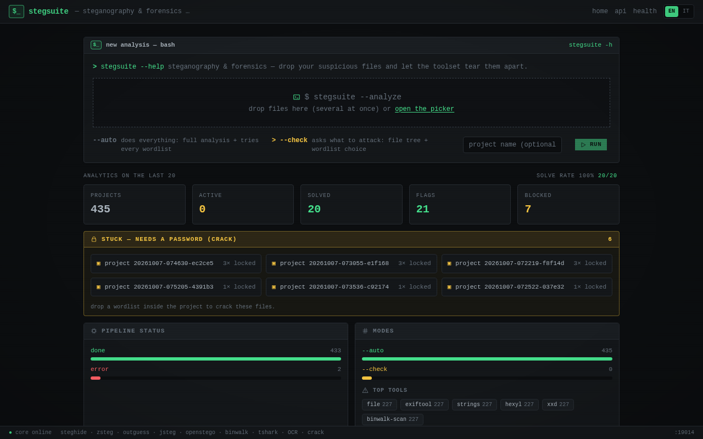
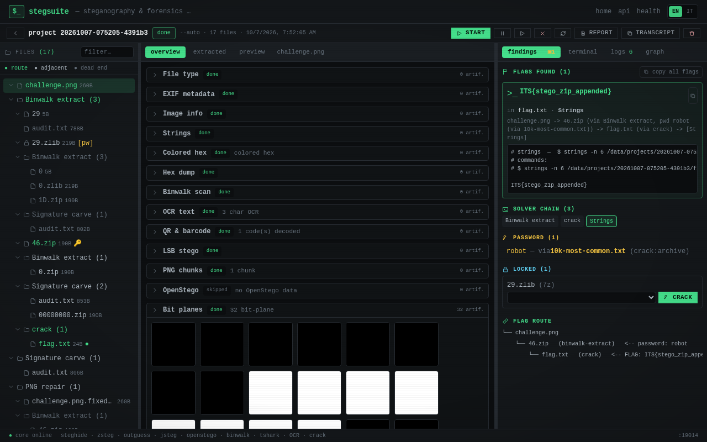
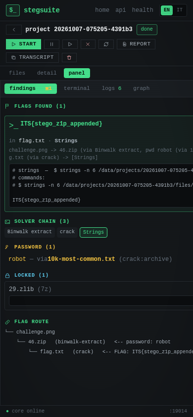

<h1 align="center">CTF Toolbox</h1>

<p align="center">
  Self-hosted, browser-based toolkit for <strong>solving CTFs</strong>.
  <br>
  One dashboard, the essential tools with a web GUI, and a single
  <code>docker compose up</code>.
</p>

<p align="center">
  <a href="README.md">🇬🇧 English</a> · <a href="README.it.md">🇮🇹 Italiano</a>
</p>

<p align="center">
  <a href="https://github.com/dexRand/ctf-docker/actions/workflows/ci.yml"></a>
</p>

<p align="center">
  
  
  
  
</p>

---

**CTF Toolbox** is a Docker Compose stack that bundles the tools people actually
reach for during a Capture The Flag event — steganalysis, encoding/crypto, web
interception, OSINT, forensics and password work — each with a **web interface**,
behind a single dashboard that lists them **ordered by phase of work** with a
short description and live status.

It is designed to live next to other self-hosted apps: every service runs on the
**19000+ port range** so it will not collide with the usual suspects (8080, 9000,
5432, …), and the heavy tools sit behind optional Compose **profiles**.

## ✨ Features

- **Single dashboard** ([Homepage](https://gethomepage.dev)) showing every tool,
  grouped by CTF phase, with a description and an up/down indicator.
- **Web GUI everywhere** — no X11 forwarding, no desktop installs.
- **Upstream images only** — no custom builds to maintain; every image is a real,
  actively used project and was verified before being added.
- **Optional heavy tools** (ZAP, Wireshark, SageMath, SpiderFoot) behind Compose
  profiles, so `./ctf up` stays light.
- **No port collisions** — everything on 19000+, all overridable from `.env`.
- **Isolated stack** — project name `ctf`, no fixed container names; the
  Hashtopolis MySQL (profile `crack`) is internal and never publishes a port.

## 🧰 Tools

| Phase | Tool | URL | What it is for | Profile |
| --- | --- | --- | --- | --- |
| Dashboard | Homepage | http://localhost:19001 | Overview and status of every tool | core |
| Crypto/Encoding | **CyberChef** | http://localhost:19002 | Base64, XOR, RSA, hashing, JWT and much more | core |
| Web | **mitmproxy** | http://localhost:19003 | Intercept and rewrite HTTP(S) · proxy on `:19004` | core |
| Utility | IT-Tools | http://localhost:19011 | Encoders, converters, hashes, regex and friends | core |
| Recon | Dork generator | http://localhost:19019 | Curated dorks + the **Google Hacking Database** (exploit-db): Google/Bing/DuckDuckGo/GitHub/Shodan queries from a target (no scraping) · sync with `./ctf dork --update` · export .md/.json | core |
| Stego workbench | **StegSuite** | http://localhost:19014 | Recursive auto analysis over 52 tools (stego, forensics, vision/OCR, audio/SSTV/network, email, base64/hex blobs, zero-width, Whitespace esolang), file tree, live log, embedded terminal, REST API | core |
| Web | **OWASP ZAP** | http://localhost:19005/zap | Web security scanner with an in-browser GUI · proxy on `:19006` · extra marketplace add-ons (alpha/beta rules, accessControl, fuzzdb, ptk…) | `web` |
| Recon | SpiderFoot | http://localhost:19007/spiderfoot/ | OSINT automation: domains, IPs, e-mails, leaks | `recon` |
| Crypto | SageMath | http://localhost:19010 | Python/Sage notebook for crypto and math | `crypto` |
| Forensics | Wireshark | http://localhost:19008 | Packet / pcap analysis with a web GUI | `forensics` |
| Audio | **Whisper-WebUI** | http://localhost:19017 | Speech-to-text with timestamps (SRT/VTT/…) via Whisper · outputs in `./data/whisper/outputs` | `audio` |
| Pwn/Rev | **ELF sandbox** | http://localhost:19018 | Run/debug/decompile untrusted binaries from a web terminal — **ELF, PE and APK** (Ghidra headless, radare2, upx, apktool, jadx, gdb, strace, ltrace, pwntools, qemu-user) · isolated network | `rev` |

> Deliberately excluded because they have no reliable upstream GUI image:
> Burp Suite, Ghidra, Autopsy, Volatility, hashcat/john (CLI tools, already on Kali).
> Distributed hash cracking (Hashtopolis) lives behind the `crack` profile.

## 🚀 Quick start

```bash
git clone https://github.com/dexRand/ctf-docker.git
cd ctf-docker
cp .env.example .env      # optional: ./ctf creates it automatically
./ctf up
```

Then open the dashboard: **http://localhost:19001**

### With plain Docker Compose

```bash
docker compose up -d                              # core tools
docker compose --profile web up -d                # core + OWASP ZAP
docker compose --profile web --profile recon up -d
docker compose --profile crack up -d              # core + Hashtopolis (hashcat)
docker compose --profile audio up -d              # core + Whisper-WebUI (speech-to-text)
docker compose --profile rev up -d                # core + ELF sandbox (active reversing)
docker compose down                               # stop everything
```

## 🎛️ CLI

The small `ctf` wrapper is a thin, readable layer over Compose:

```bash
./ctf up                  # core tools
./ctf up web              # core + a profile
./ctf up web forensics    # combine profiles
./ctf up-all              # everything (heavy: several GB of images)
./ctf status              # container status
./ctf logs wireshark      # follow logs of one service
./ctf reports             # browse ./data (projects, extracts, wordlists)
./ctf pull <url>          # download a file (e.g. a challenge attachment) into ./data/pull
./ctf scan <file>         # analyze a file with StegSuite and print the flags
./ctf down                # stop and remove containers
```

### Dork generator (easy)

Google/Bing/DuckDuckGo/GitHub/Shodan queries from a target — **no scraping**: it
only builds the query and the ready-to-open link. The page at
**http://localhost:19019** shows the curated presets *and* the whole
**Google Hacking Database** (exploit-db), synced automatically on first use.

```bash
./ctf dork                          # sync the GHDB (first run) + open the web page
./ctf dork example.com              # print ready-to-open dork URLs in the terminal
./ctf dork example.com --ghdb camera     # search the GHDB (add a target to scope it with site:)
./ctf dork --update                 # refresh the GHDB cache (config/dork/ghdb.json)
./ctf dork-test                     # generator self-test
```

Plugins are just JSON files: search providers in `config/dork/providers/` (one
per engine) and dorks in `config/dork/dorks/` (one per group, `{name, presets:[…]}`).
Add a file and run `./ctf dork --build` — no code changes needed.

## 🧪 Analysis

Use **StegSuite** (below) for the recursive steg/forensics pipeline, the flag
hunt and the cracking — it replaces the old `triage` CLI/GUI. Wordlists in
`./wordlists/` (mounted at `/wordlists`) are tried smallest → largest; the full
`rockyou.txt` is baked into the image.

| Profile | Adds |
| --- | --- |
| *(core)* | Homepage, CyberChef, mitmproxy, IT-Tools, Dork generator, StegSuite, FileBrowser |
| `web` | OWASP ZAP |
| `recon` | SpiderFoot |
| `crypto` | SageMath |
| `forensics` | Wireshark |
| `crack` | Hashtopolis (distributed hashcat) |
| `audio` | Whisper-WebUI (speech-to-text with timestamps) |
| `rev` | ELF sandbox (active reversing: gdb/strace/pwntools/qemu) |

For audio challenges, activate the `audio` profile and open **Whisper-WebUI**
(http://localhost:19017): upload an audio/video file (or use a YouTube link /
the mic) and get a transcript with timestamps as SRT/VTT/…. On CPU the default
model is `small` (change it from the Model dropdown); downloaded models and
outputs stay in `./data/whisper/` and show up in FileBrowser.

## 🔌 Ports

All host ports live in the **19000+ range** and are configurable in `.env`:

| Port | Service |
| ---: | --- |
| 19000 | *(libero — AperiSolve rimosso)* |
| 19001 | Homepage (dashboard) |
| 19002 | CyberChef |
| 19003 / 19004 | mitmweb UI / mitmproxy |
| 19005 / 19006 | ZAP UI (`/zap`) / ZAP proxy |
| 19007 | SpiderFoot |
| 19008 / 19009 | Wireshark HTTP / HTTPS |
| 19010 | SageMath (Jupyter) |
| 19011 | IT-Tools |
| 19012 | FileBrowser Quantum (browse ./data, no login, localhost only) |
| 19014 | StegSuite workbench + API (localhost only) |
| 19015 / 19016 | Hashtopolis backend / frontend (profile `crack`) |
| 19017 | Whisper-WebUI speech-to-text (profile `audio`) |
| 19018 | ELF sandbox (active reversing, profile `rev`) |
| 19019 | Dork generator (Google/GitHub/Shodan queries) |

## 📂 Project structure

```
compose.yaml            services definition (project name: ctf)
ctf                     CLI wrapper (up / up-all / down / status / logs)
.env.example            ports and configuration
config/homepage/        dashboard config (services / settings / widgets)
config/zap/             ZAP working dir (certificates)
config/whisper/         Whisper-WebUI default config (profile `audio`)
rev/                    ELF active-analysis sandbox (ttyd + Ghidra headless + gdb/qemu, profile `rev`)
osint/                  area OSINT del collega + override compose (vedi osint/README.md)
SPEC.md                 specification
tasks/                  plan.md + todo.md
.opencode/              Agent Skills (MIT — see ATTRIBUTION.md)
```

## 🧪 StegSuite (stego workbench)

**StegSuite** is the all-in-one stego/forensics app (the AperiSolve replacement):
http://localhost:19014 (localhost only).

- **Auto / Check** modes: Auto runs everything and tries every wordlist; Check
  first scans, then lets you choose what to attack.
- **Recursive, ordered** analysis over **48 tools**: `file`, `exiftool`,
  `identify`, `ffprobe`, `pdfinfo`, `strings`, `xxd`/`hexdump`/`hexyl`,
  `decode`, `pdfid`, `pdftotext`, `binwalk` (scan + `binwalk -e`), `foremost`,
  `nested-archive` (deep archive chains), `7z`, `git` (repo history/reflog/objects),
  `office` (unzip Office/OpenDocument
  parts + whitespace-split base64), `pngcheck`, `png-repair`,
  `image-repair` (JPEG/BMP header/height),
  `qr` (zbarimg), `pcap` (tshark; TLS with a provided key **or a TLS 1.3 keylog**,
  HTTP/2 headers, pcapng comments), `zsteg`,
  `psimage` (Invoke-PSImage B/G LSB), `lsb-carve` (carve a hidden file out of the
  LSB planes), `elf`/`readelf`/`objdump` (ELF structure,
  checksec, disassembly), `steghide`, `outguess`, `jsteg`,
  `png-chunks`, `openstego`, `bit-planes`,
  `channel-remap`, `image-enhance`, `gif-frames` (split + frame-diff + delay
  decode + per-frame OCR), `ocr` (tesseract), `spectrogram`, `waveform`,
  `wav-lsb`, `wav-levels` (quantised samples → hex), `morse`, `morse-text`, `dtmf`, `sstv` (Scottie S1/S2).
- **GUI**: terminal-themed, defaults to **English** with an any-time **EN/IT**
  switch (choice persisted), file tree, per-tool output, extracted children,
  image/audio previews, live per-file **progress**, **toasts**, live log over
  WebSocket, embedded **terminal** (xterm.js), a Markdown **report** with its
  own language selector, and a **responsive** one-pane-per-view layout on mobile.
- **Flag hunt + cracking**: ZIP (incl. AES via hashcat) with **hashcat rules/mask
  + CPU budget**, ZipCrypto **known-plaintext (`bkcrack`)**, steghide, PDF;
  upload of new **wordlists** (persisted). Custom flag formats via a **`FLAG_PATTERN`**
  regex (applied to every source, braces not required).
- **Ops/security**: schema migrations via **Alembic**, opt-in per-IP **rate
  limiting** (`RATE_LIMIT_RPM`) and project **retention** (`RETENTION_DAYS`),
  optional `X-API-Key`.
- **REST API** (OpenAPI at `/api/docs`), including stateless single-tool runs:
  `POST /api/v1/tools/{tool}`.
- **Docs**: `docs/ADDING-A-TOOL.md` (add an analyzer), `docs/API.md` (drive the
  API from other projects), `docs/CHALLENGES.md` (reference challenges + flags
  used to verify the suite, with manual solve commands).

## 📸 Screenshots

**Home — drop a challenge and run:**



**A solved project — flag, solver chain, cracked password and flag route:**



**Responsive — one pane at a time on mobile:**



## ⚙️ Configuration

Everything is driven by `.env` (created from `.env.example`):

| Variable | Purpose |
| --- | --- |
| `*_PORT` | Host port of each service (all in 19000+) |
| `HOMEPAGE_ALLOWED_HOSTS` | Hosts allowed to reach the dashboard (add your LAN IP for remote access) |
| `MITMWEB_PASSWORD` | Password for the mitmweb GUI (user is ignored) |
| `PUID` / `PGID` / `TZ` | User mapping and timezone for Wireshark |
| `HASHTOPOLIS_*` | Hashtopolis admin/DB credentials (profile `crack`) |

## 📝 Notes

- **First start** pulls large images (ZAP, Wireshark, SageMath): give it time.
  Running *all* profiles at once needs roughly **8 GB of free RAM**.
- **SageMath** prints its Jupyter access token in the logs:
  `./ctf logs sagemath`.
- **mitmproxy** requires a password: the login page uses `MITMWEB_PASSWORD`
  (default `mitm`). Its dashboard status checks an unauthenticated endpoint.
- **Profiled tools** show up as *down* on the dashboard until you start that
  profile — that is expected.
- The **StegSuite** image is built locally from a pinned stego toolset base; the
  first `./ctf up` builds it once.
- **FileBrowser Quantum** (the maintained fork of the archived FileBrowser) is
  bound to `127.0.0.1` only and runs with **no login** (`auth.methods.noauth`).
- The **dashboard** mounts the Docker socket **read-only** to show live container
  status and host CPU/RAM/disk. Homepage is bound to `127.0.0.1`; if you expose it,
  drop that mount (a socket mount is privileged).

## 🤖 Agent Skills

The skills under `.opencode/skills/` come from
[`addyosmani/agent-skills`](https://github.com/addyosmani/agent-skills) (MIT).
See [`.opencode/ATTRIBUTION.md`](.opencode/ATTRIBUTION.md) and
[`AGENTS.md`](AGENTS.md).

## 📚 Documentation

- Specification: [`SPEC.md`](SPEC.md)
- Plan and tasks: [`tasks/plan.md`](tasks/plan.md) · [`tasks/todo.md`](tasks/todo.md)
- Agent guide: [`AGENTS.md`](AGENTS.md)

## 📄 License

MIT — see [`LICENSE`](LICENSE) for the project, and
[`.opencode/LICENSE-agent-skills`](.opencode/LICENSE-agent-skills) for the
imported Agent Skills.
